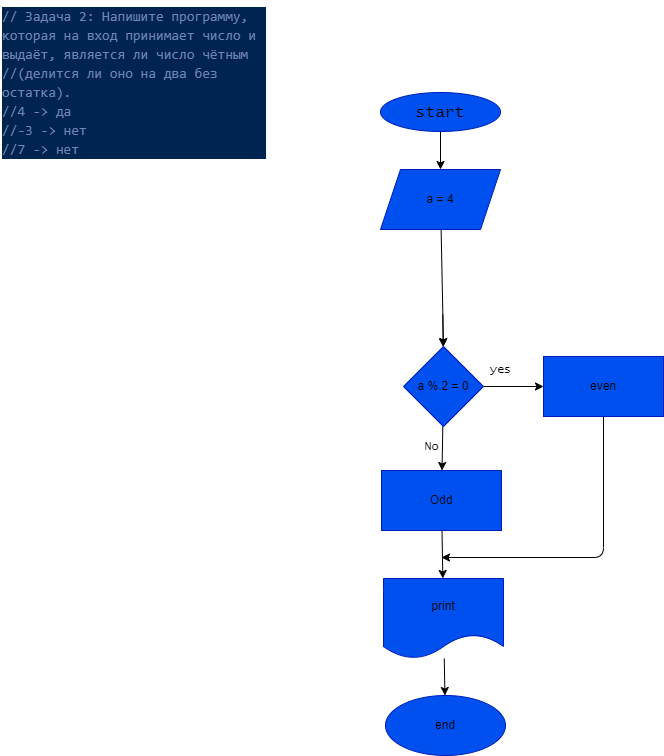

## Задача 1: Напишите программу, которая принимает на вход три числа и выдаёт максимальное из этих чисел. ->
 

## Задача 2: Напишите программу, которая на вход принимает число и выдаёт, является ли число чётным (делится ли оно на два без остатка). ->  [КОД](Exemple_002_EvenAndOdd/Program.cs)